## Java.iText.Pdf
### Создание pdf файлов

***Щелкните на значке***

***и увидите картинку с результатом работы данного кода***

<!-- TABLE OF CONTENTS -->

  
ColumnAndRowSpan.java

  <ol>
    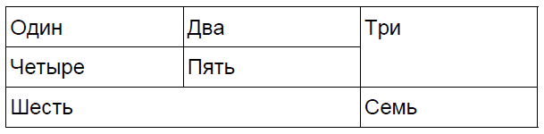
  </ol>

<!-- TABLE OF CONTENTS -->

  
ListExample.java

  <ol>
    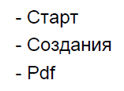
  </ol>

<!-- TABLE OF CONTENTS -->

  
Main.java

  <ol>
    
  </ol>

<!-- TABLE OF CONTENTS -->

  
TableArrayExample.java

  <ol>
    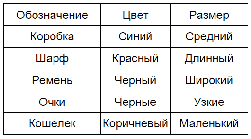
  </ol>

<!-- TABLE OF CONTENTS -->

  
TableCellBorderColor.java

  <ol>
    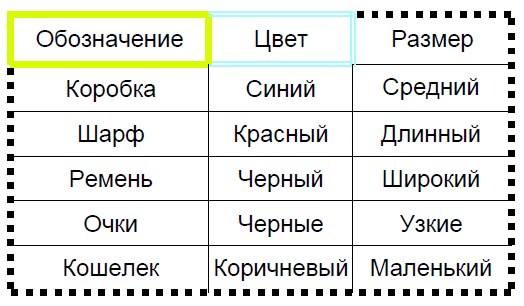
  </ol>

<!-- TABLE OF CONTENTS -->

  
TableColorArrayExample.java

  <ol>
    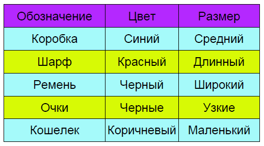
  </ol>

<!-- TABLE OF CONTENTS -->

  
TableExample.java

  <ol>
    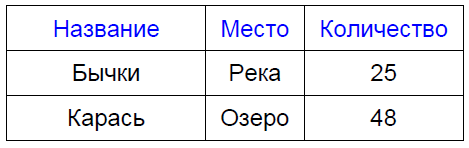
  </ol>

<!-- TABLE OF CONTENTS -->

  
TableImage.java

  <ol>
    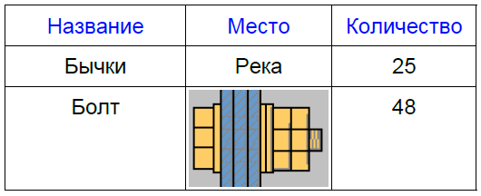
  </ol>

<!-- TABLE OF CONTENTS -->

  
TableListExample.java

  <ol>
    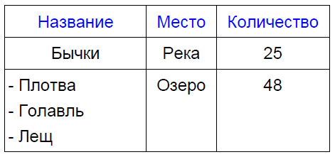
  </ol>

<!-- TABLE OF CONTENTS -->

  
ColumnAndRowSpanInDetail.java

  <ol>
    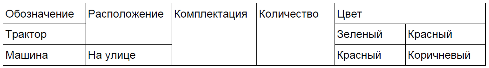
  </ol>

<!-- TABLE OF CONTENTS -->

  
ChangeListSymbol.java

  <ol>
    
  </ol>

<!-- TABLE OF CONTENTS -->

  
ImageAsListIcon.java

  <ol>
    
  </ol>

<!-- TABLE OF CONTENTS -->

  
SetPageSizeInPdf.java

  <ol>
    Назначение формата А5 и поворот листа на 90 градусов.
  </ol>

<!-- TABLE OF CONTENTS -->

  
Invoice.java

  <ol>
    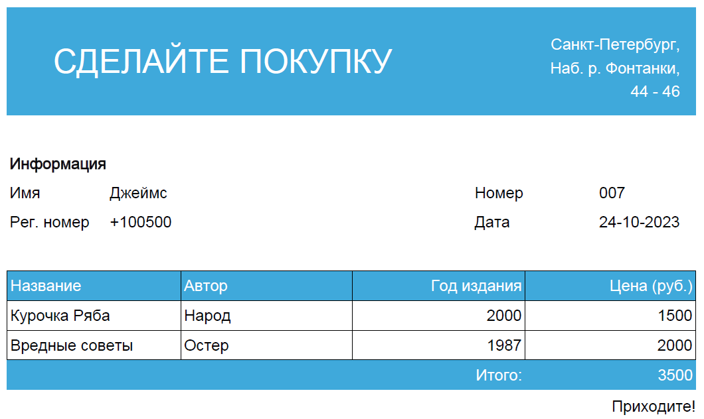
  </ol>

<!-- TABLE OF CONTENTS -->

  
WorkingWithTheFont.java

  <ol>
    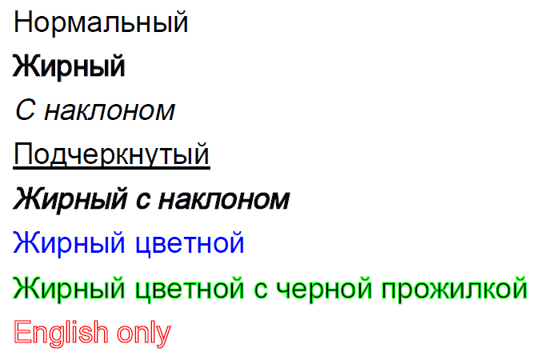
  </ol>

<!-- TABLE OF CONTENTS -->

  
UseOfStyleInPdf.java

  <ol>
    
  </ol>

<!-- TABLE OF CONTENTS -->

  
EmbedFonts.java

  <ol>
    
  </ol>

<!-- TABLE OF CONTENTS -->

  
WatermarkImage.java

  <ol>
    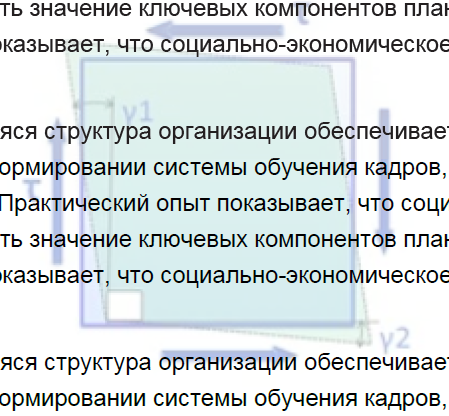
  </ol>

(<a href="#readme-top">back to top</a>)
